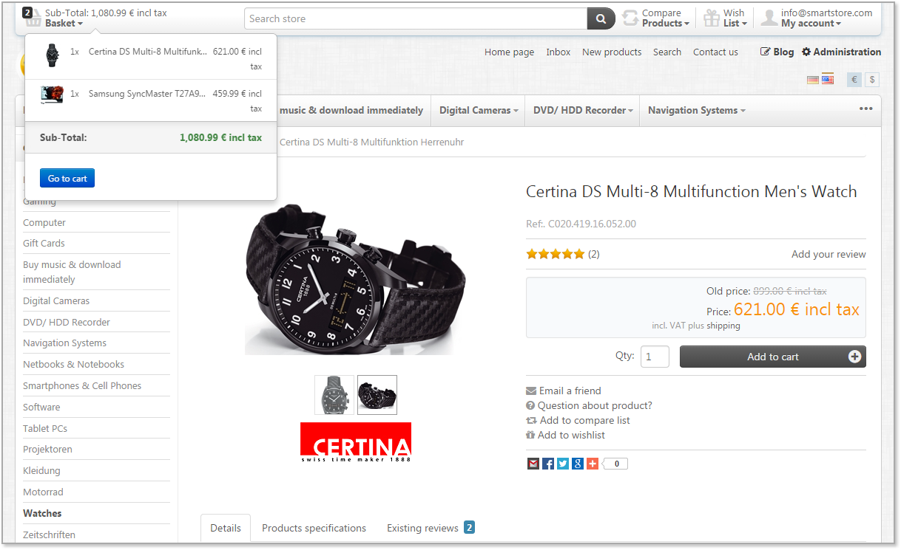

## Overview

  

SmartStore.NET is a free, open source, full-featured e-commerce solution for companies of any size. It is web standards compliant and incorporates the newest Microsoft web technology stack.

**SmartStore.NET includes all essential features to create multilingual and multi-currency stores** targeting desktop or mobile devices and enabling SEO optimized rich product catalogs with support for an unlimited number of products and categories, variants, bundles, datasheets, ESD, discounts, coupons and many more.

A comprehensive set of tools for CRM & CMS, sales, marketing, payment & shipping handling, etc. makes SmartStore.NET a powerful all-in-one solution fulfilling all your needs... totally FREE!

**SmartStore.NET delivers a beautiful and configurable shop front-end out-of-the-box**, built with a design approach on the highest level, including components like `Twitter Bootstrap`, `Less CSS` and others. The innovative ShopBar, a powerful layered navigation, reviews & ratings, an optimized checkout process... they all provide a perfect shopping experience for your buyers.

The state-of-the-art architecture of SmartStore.NET - with `ASP.NET 4.5` + `MVC 5`, `Entity Framework 6` and Domain Driven Design approach - makes it easy to extend, extremely flexible and essentially fun to work with ;-)

* **Website:** [http://www.smartstore.com/en/net](http://www.smartstore.com/en/net)
* **Forum:** [http://community.smartstore.com](http://community.smartstore.com)
* **Marketplace:** [http://community.smartstore.com/marketplace](http://community.smartstore.com/marketplace)
* **Documentation:** [SmartStore.NET Documentation in English](http://docs.smartstore.com/display/SMNET/SmartStore.NET+Documentation+Home)

## Highlights

### Technology & Design

* State of the art architecture thanks to `ASP.NET 4.5`, `ASP.NET MVC 5`, `Entity Framework 6` and Domain Driven Design
* Easy to extend and extremely flexible thanks to modular design
* (NEW) A powerful theming engine lets you create themes & skins with minimum effort thanks to theme inheritance
* Consistent and sophisticated use of modern components such as `jQuery`, `Twitter Bootstrap`, `LESS` & more in the front and back end.
* Easy shop management thanks to modern and clean UI
* Out of the box shop design on the highest level
* Revolutionary Shopbar for the best shopping experience
* Point&Click Theme configuration

### Features

* Multi-Store support
* Unlimited number of products and categories
* Product Bundles
* RESTful WebApi
* Multi-language support
* 100% Mobile optimized
* Perfectly optimized for search engines
* Trusted Shops precertification
* 100% compliant with German jurisdiction
* Sales-, Customer- & Inventory-management
* Comprehensive CRM features
* Powerful Discount System
* Powerful layered navigation in the shop
* Numerous Payment and Shipping Providers and options
* Sophisticated Marketing & Promotion capabilities (Gift cards, Reward Points, discounts of any type and more)
* Reviews & Ratings
* CMS (Blog, Forum, custom pages & HTML content etc.)
* and many more...

## Project Status
SmartStore.NET V2.6.0 has been released on June 23, 2016. The highlights are:

* Major improvements in Importer & Exporter: better field mapping, higher performance, bug fixes etc.
* 'PayPal PLUS' payment plugin
* 'paydirekt' payment plugin
* 'Viveum' payment plugin
* 'BeezUP' export provider
* (Dev) Publishing SmartStore.Web from within Visual Studio now deploys the project correctly. No need to execute ClickToBuild.cmd anymore. Just publish directly to any target, including Azure.
* Lots of bug fixes

## Try it online

We have set up a live online demo for you so you are able to test SmartStore.NET without local installation. Get a first impression and test all available features in the front- and in the backend. Please keep in mind that the backend demo is shared and other testers can modify data at the same time.

* [**Frontend**](http://frontend.smartstore.net/en) (User: demo, PWD: 1234)
* [**Backend**](http://backend.smartstore.net/en/login) (User: demo, PWD: 1234)

## How to install

* Download the latest stable release from the download tab and unzip it to your web folder
* Setup a website in IIS and point the file directory to your unzipped folder
* Fire up your browser and follow the installation instructions
* Enjoy ;-)

### System requirements

* IIS 7+
* ASP.NET 4.5
* ASP.NET MVC 5
* MS SQL Server 2008 Express (or higher) OR MS SQL Server Compact 4
* Full Trust

## License

SmartStore.NET is released under the [GPLv3 license](http://www.gnu.org/licenses/gpl-3.0.txt).
