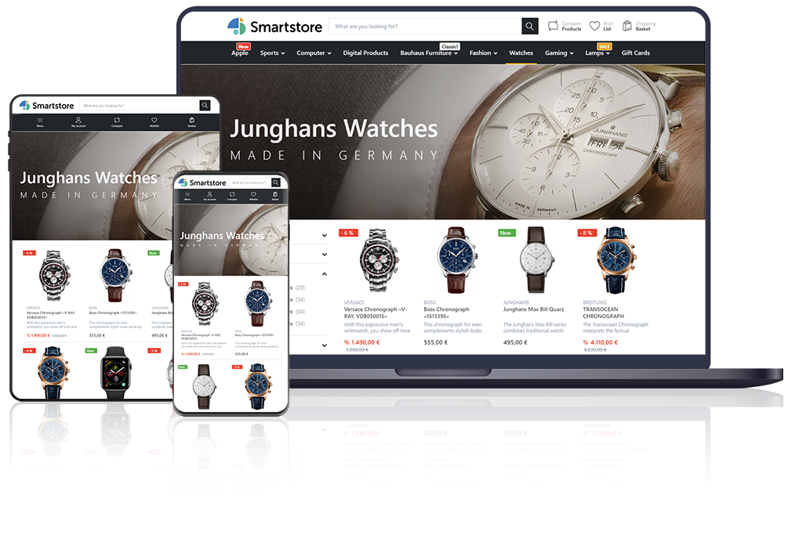

	

	
	
	
	
	
	

	<a href="#try-it-online">Try Online</a> ∙
    <a href="http://docs.smartstore.com/display/SMNET">Docs</a> ∙ 
	<a href="http://community.smartstore.com">Forum</a> ∙ 
	<a href="http://community.smartstore.com/marketplace">Marketplace</a> ∙ 
	<a href="http://translate.smartstore.com/">Translations</a>

 

Smartstore is a free, open source, full-featured e-commerce solution for companies of any size. It is web standards compliant and incorporates the newest Microsoft web technology stack.

__Smartstore includes all essential features to create multilingual and multi-currency stores__ targeting desktop or mobile devices and enabling SEO optimized rich product catalogs with support for an unlimited number of products and categories, variants, bundles, datasheets, ESD, discounts, coupons and many more.

A comprehensive set of tools for CRM & CMS, sales, marketing, payment & shipping handling, etc. makes Smartstore a powerful all-in-one solution fulfilling all your needs.

 

  

**Smartstore delivers a beautiful and configurable shop front-end out-of-the-box**, built with a design approach on the highest level, including components like `Bootstrap 4`, `Sass` and others. The supplied theme _Flex_ is modern, clean and fully responsive, giving buyers the best possible shopping experience on any device. 

The state-of-the-art architecture of Smartstore - with `ASP.NET 4.5` + `MVC 5`, `Entity Framework 6` and Domain Driven Design approach - makes it easy to extend, extremely flexible and essentially fun to work with ;-)

* **Website:** [https://smartstore.com](https://smartstore.com)
* **Forum:** [http://community.smartstore.com](http://community.smartstore.com)
* **Marketplace:** [http://community.smartstore.com/marketplace](http://community.smartstore.com/marketplace)
* **Translations:** [http://translate.smartstore.com/](http://translate.smartstore.com/)
* **Documentation:** [Smartstore Documentation in English](http://docs.smartstore.com/display/SMNET)
* **Developer Extension:** [Visual Studio Marketplace](https://marketplace.visualstudio.com/items?itemName=SmartStoreAG.Smartstore)
* **Azure Marketplace:** [Azure Marketplace](https://azuremarketplace.microsoft.com/en-us/marketplace/apps/smartstore-ag.smartstorenet?tab=Overview)

&nbsp;

## Highlights

### Technology & Design

* State of the art architecture thanks to `ASP.NET 4.5`, `ASP.NET MVC 5`, `Entity Framework 6` and Domain Driven Design
* Easy to extend and extremely flexible thanks to modular design
* Highly scalable thanks to full page caching and web farm support 
* A powerful theming engine lets you create themes & skins with minimum effort thanks to theme inheritance
* Point&Click Theme configuration
* Highly professional search framework based on Lucene.NET, delivering ultra fast faceted search results
* Powerful and lightning-fast media manager
* Powerful rule system for visual business rule creation
* Consistent and sophisticated use of modern components such as `Bootstrap 4`, `Vue.js`, `jQuery` `Sass` & more in the front and back end.
* Easy shop management thanks to modern and clean UI

### Features

* NEW: Media Manager
* NEW: Rule Builder
* Unlimited number of products and categories
* Multi-Store support
* Product Bundles
* RESTful WebApi
* Multi-language and RTL support
* CMS Page Builder
* CMS Menu Builder
* Modern, clean, SEO-optimized and fully responsive Theme based on Bootstrap 4
* Ultra fast search framework with faceted search support
* Extremely scalable thanks to output caching, REDIS & Microsoft Azure support
* NEW: Tree-based permission management (ACL) with inheritance support
* *Trusted Shops* precertification
* 100% compliant with German jurisdiction
* Sales-, Customer- & Inventory-management
* Comprehensive CRM features
* Powerful Discount System
* Powerful layered navigation in the shop
* Numerous Payment and Shipping Providers and options
* Sophisticated Marketing & Promotion capabilities (Gift cards, Reward Points, discounts of any type and more)
* Reviews & Ratings
* CMS (Blog, Forum, custom pages & HTML content etc.)
* and many more...

## Project Status

Smartstore V4.0.0 has been released on 25 June, 2020. The highlights are:

* **Media Manager**: Powerful and lightning-fast explorer/manager for media files (commercial plugin exclusively bundled with Pro Edition)
* **Rule Builder**: Powerful rule system for visual business rule creation
  * Dozens of predefined rules out-of-the-box
  * Supports logical operators (AND/OR) and unlimited grouping/nesting
  * Cart rules: can be applied to discounts, shipping and payment methods
  * Customer rules: used to auto-assign customers to customer groups for 1-to-1 content targeting
  * Product rules: used to auto-assign products to categories based on filter definitions (e.g. price, brand, color, stock etc.)
* **New permission (ACL) system**: Granular tree-based permission management based on customer groups. Supports inheritance to allow or deny entire permission ranges
* **Personalized product recommendations**: Replaces homepage products dynamically with personalized product recommendations based on customer interests. (commercial plugin)
* **Geo Blocker**: Restricts shop access based on visitor country or IP address ranges (commercial plugin)
* **Dashboard with charts**: New dashboard widgets display key data like orders, customers, bestsellers etc. in nice graphical charts. 

## Try it online

We have set up a live online demo for you so you are able to test Smartstore without local installation. Get a first impression and test all available features in the front- and in the backend. Please keep in mind that the backend demo is shared and other testers can modify data at the same time.

* [**Frontend**](https://demo.smartstore.com/frontend/en) (User: demo, PWD: 1234)
* [**Backend**](https://demo.smartstore.com/backend/en/login) (User: demo, PWD: 1234)

## How to install

* Download the latest stable release from the download tab and unzip it to your web folder
* Setup a website in IIS and point the file directory to your unzipped folder
* Fire up your browser and follow the installation instructions
* Enjoy ;-)

NOTE: Smartstore 4 requires [Visual C++ Redistributable für Visual Studio 2015](https://www.microsoft.com/en-US/download/details.aspx?id=52685) which is already pre-installed on most systems. If, nevertheless, it is missing on your web server, just download and execute the installer or ask your hosting provider to do that for you.

### System requirements

* IIS 7+
* ASP.NET 4.5+
* MS SQL Server 2008 Express (or higher) OR MS SQL Server Compact 4
* Visual C++ Redistributable für Visual Studio 2015-2019 ([Download](https://support.microsoft.com/en-us/help/2977003/the-latest-supported-visual-c-downloads))
* Full Trust

## License

Smartstore Community Edition is released under the [GPLv3 license](http://www.gnu.org/licenses/gpl-3.0.txt).
